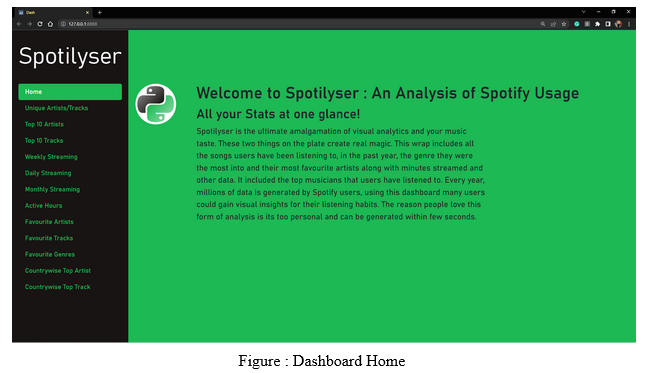
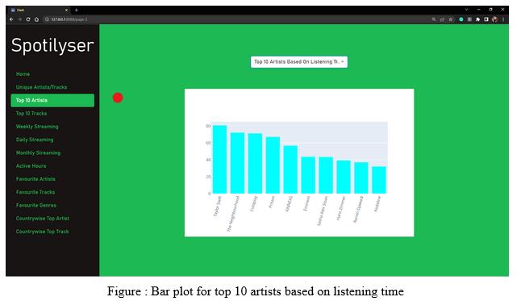
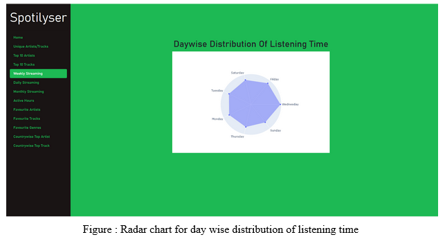
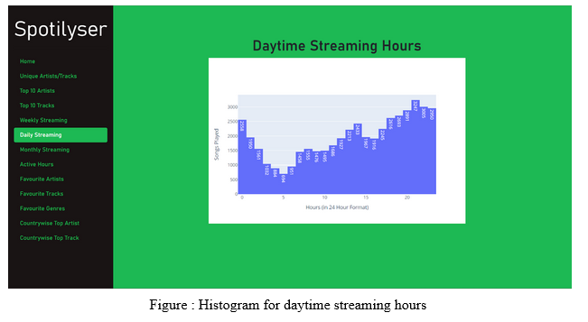
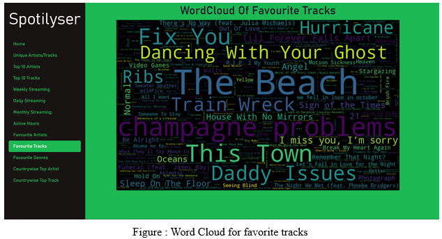
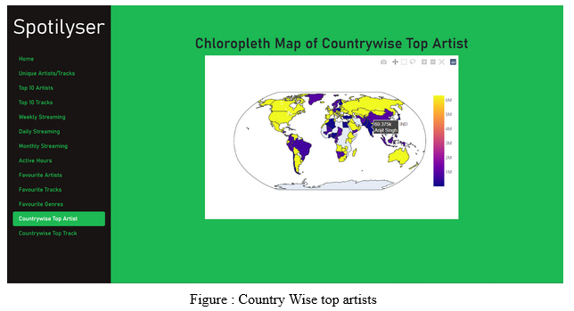

# Spotilyser
## Analytical Dashboard for Spotify.

The objective of the project is to create a visualization dashboard which helps the user to watch for patterns and know about their streaming history. The project will help the users to be able to know about their average listening habits on a daily, weekly and even monthly basis. It will also help them know about their active hours too. The domain of music has become immensely popular these days and hence it is a good entertainment source for people to know about their listening habits. This project would thus help the users to know about their top artists and tracks so that they can explore more similar songs and genres.

## Setup
1. pip install -r requirements.txt
2. Setup the API(s) with client_id, secret keys for Spotify, Last.fm, Spotipy and store them in a key.py file.
3. Request Historical Data from Spotify(takes 3-4 days, for it to process), use this streaming data's json file given from Spotify to provide data to the dashboard.
4. Run app.py and open it in your local browser at the hosted port.

## Designs

  
  
  
  
  
  

## Contributors

